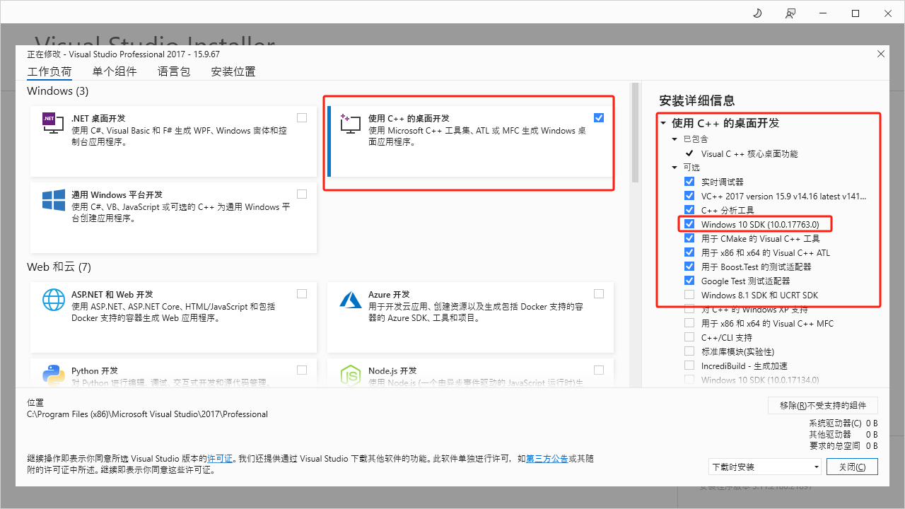
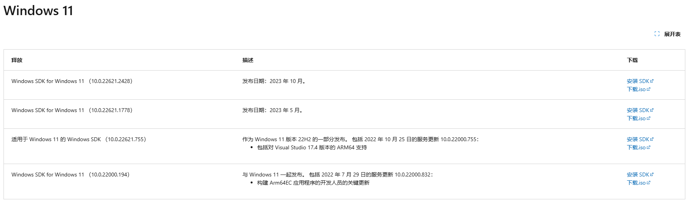
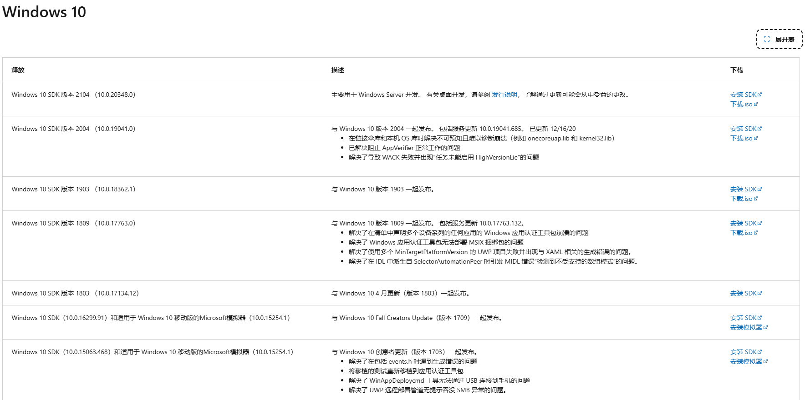
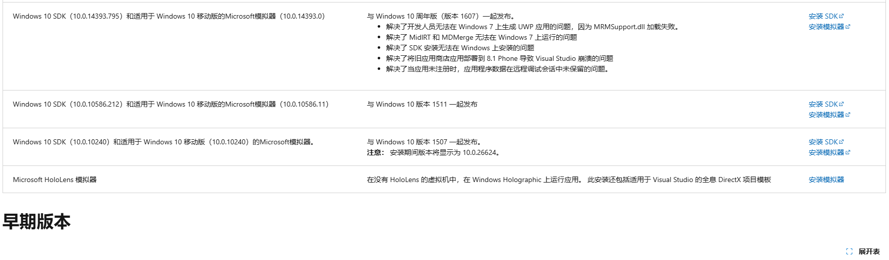
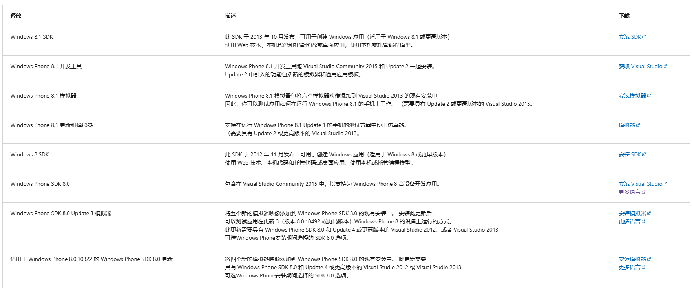
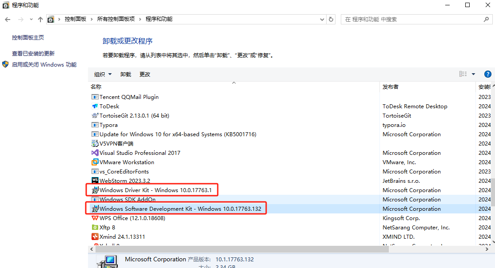

## Windows驱动开发

### 环境搭建

理解 Windows 版本、SDK 版本和 WDK 版本的对应关系非常重要，特别是开发 Windows 驱动程序时。每个版本都有自己对应的编号和更新，通常遵循以下逻辑：

### 1. **Visual Studio 版本与 WDK、SDK 兼容性**

Visual Studio 支持特定的 WDK 和 SDK 版本，具体匹配如下：

- Visual Studio 2022
  - 支持 Windows 10 和 Windows 11 的最新 WDK 版本。
  - 兼容的 SDK/WDK 版本：建议使用 10.0.19041（Windows 10 2004）及以上。
- Visual Studio 2019
  - 支持 Windows 10 早期版本的 WDK，以及 10.0.18362 和更高版本的 SDK。
  - 最佳选择是 Windows 10, version 1809 及以上版本的 SDK 和 WDK。
- Visual Studio 2017
  - 支持 Windows 10 的较早版本 SDK 和 WDK，比如 10.0.15063 (Windows 10 1703) 到 10.0.17134 (Windows 10 1803)。

### 2. **Windows 版本、SDK 版本和 WDK 版本、VS版本的对应表**

| Windows 版本          | SDK 版本       | WDK 版本       | Visual Studio 版本        |
| --------------------- | -------------- | -------------- | ------------------------- |
| Windows 7             | 7.1.0          | 7.1.0          | Visual Studio 2008        |
| Windows 7 SP1         | 7.1.0          | 7.1.0          | Visual Studio 2008        |
| Windows 8             | 8.0            | 8.0            | Visual Studio 2012        |
| Windows 8.1           | 8.1            | 8.1            | Visual Studio 2013        |
| Windows 10 (1507)     | 10.0.10240     | 10.0.10240     | Visual Studio 2015        |
| Windows 10 (1511)     | 10.0.10586     | 10.0.10586     | Visual Studio 2015        |
| Windows 10 (1607)     | 10.0.14393     | 10.0.14393     | Visual Studio 2015 / 2017 |
| Windows 10 (1703)     | 10.0.15063     | 10.0.15063     | Visual Studio 2017        |
| Windows 10 (1709)     | 10.0.16299     | 10.0.16299     | Visual Studio 2017        |
| Windows 10 (1803)     | 10.0.17134     | 10.0.17134     | Visual Studio 2017        |
| **Windows 10 (1809)** | **10.0.17763** | **10.0.17763** | **Visual Studio 2017**    |
| Windows 10 (1903)     | 10.0.18362     | 10.0.18362     | Visual Studio 2019        |
| Windows 10 (1909)     | 10.0.18363     | 10.0.18363     | Visual Studio 2019        |
| Windows 10 (2004)     | 10.0.19041     | 10.0.19041     | Visual Studio 2019 / 2022 |
| Windows 10 (20H2)     | 10.0.19042     | 10.0.19041     | Visual Studio 2019 / 2022 |
| Windows 10 (21H1)     | 10.0.19043     | 10.0.19041     | Visual Studio 2019 / 2022 |
| Windows 10 (21H2)     | 10.0.22000     | 10.0.22000     | Visual Studio 2022        |
| Windows 11            | 10.0.22000     | 10.0.22000     | Visual Studio 2022        |
| Windows 11 (22H2)     | 10.0.22621     | 10.0.22621     | Visual Studio 2022        |

### 3. **选择 SDK 和 WDK 的基本原则**

- **SDK 版本**：应选择与目标 Windows 版本对应的 SDK。比如，如果目标是 Windows 10 (1809)，则应使用 Windows 10 SDK 版本 10.0.17763。
- **WDK 版本**：通常，WDK 版本与对应的 SDK 版本一致（例如，10.0.17763 SDK 对应 10.0.17763 WDK）。在驱动开发中，确保 WDK 和 SDK 版本一致性至关重要。

### 4.VS安装

假如要开发Windows 10 (1809)的驱动，那就就下载Visual Studio 2017，安装的时候，请勾选如下图：

请注意，安装VS2017的时候，默认安装了SDK（10.0.17763.0），如果和需要开发驱动的目标Windows平台版本不一致，这里就取消勾选。

我这里刚好和Windows 10 (1809)对应，就按照这个安装了。

### 5.安装SDK

请前往https://developer.microsoft.com/zh-cn/windows/downloads/sdk-archive/查看

或者百度搜索Windows SDK，跳转微软官网，找早期版本，如下图：

### 4. 查看已安装SDK和WDK版本

如图，17763只要对的上，就基本没问题

